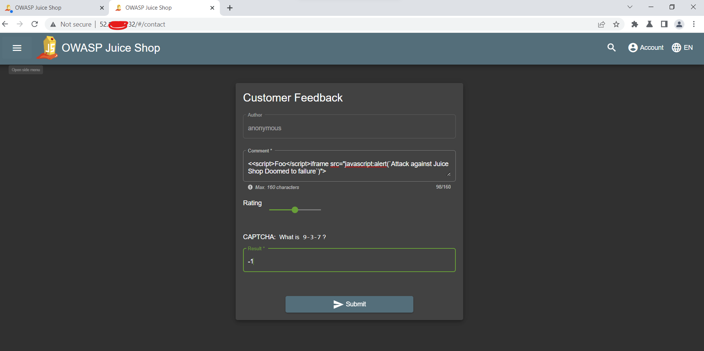

# 简介  
漏洞的利用是本实验的第三部分，本实验的目的是演示Azure WAF在识别针对Web应用的可疑活动和恶意攻击及保护Web应用方面的能力。本部分内容主要测试Azure WAF针对Cross Site Scripting(XSS)攻击的防护能力及日志记录相关的功能。

本部分实验主要包含如下内容:   

* 模拟针对OWASP Juice Shop实例的直接Cross Site Scripting(XSS)攻击   
* 模拟针对通过Application Gateway(启用WAF)发布的Juice Shop应用的XSS攻击  
* 对比在两种场景下的区别  
* 通过Azure Monitor Workbook for WAF监控检测到的攻击活动  

# 前提条件   

1. 完成[WSL及Burp Suite安装](./Lab-Configure-WSL-Burpsuite.md)
2. 完成[侦察攻击](./Lab-Reconnaissance.md)   

# 测试步骤   
[Burp Suite](https://portswigger.net/burp/documentation/desktop/getting-started)是一套全面的Web应用安全测试工具，该工具包含在Kali Linux发行版中，也可以单独下载进行安装。

Burp Suite将会被用来检测应用请求和响应以对比在使用Azure WAF前后分别使用XSS注入时Juice Shop应用程序的响应情况，Burp Suite的内置浏览器将会被用于本实验以便其能在为启用 ***intercept*** 功能的情况下捕获应用及响应相关的请求。

## 配置Burp Suite  

为了能够进行安全测试，在使用Burp Suite时需要进行一些简单配置,具体配置步骤如下:     

1. 通过Windows开始菜单搜素`Burp Suite`并打开，保持`Temporary Project`不变并点击`Next`  


2. 在配置部分保持`Use Burp defaults`不变并点击`Start Burp`   
  

3. 在启动后的界面上选择 ***Proxy*** --> ***Intercept*** --> ***Open browser*** 打开Burp Suite内置浏览器访问Jucice Workshop应用程序及Application Gateway，确认可以正常访问应用   
 

直接访问Container Instance IP上的3000端口  


直接访问Application Gateway IP

  
4. 在Burp Suite界面上点击 ***Target*** --> ***Scope*** 设置Burp Suite只捕获特定网站的响应和请求，在本实验中，需要捕获从VM至Juice Shop实例及至Application Gateway的请求和响应，配置内容如下:  
&ensp; 在 ***Include in scope*** 部分，添加如下两个URL:  
&ensp; 1. http://{Jucie Shop Container Instance IP}:3000/  
&ensp; 2. http://{Application Gateway IP}/

&ensp; 在 ***Exclude from scope*** 部分添加如下两个URL来减少捕获的无用信息  
&ensp; (1). http://{Jucie Shop Container Instance IP}:3000/socket.io/
&ensp; (2). http://{Application Gateway IP}/socket.io/     

向Jucie Shop应用程序注入XSS代码   

### 第一次攻击 
1. 打开Burp Suite的内置浏览器，直接访问未受Azure WAF保护的Juice Shop应用程序  

2. 点击Juice Workshop左上角菜单栏，打开`Customer Feedback`部分
   

3. 在Comment部分填入如下内容并改变Rating值，完成CAPTCHA计算后点击`Submit`   

```
<<script>Foo</script>iframe src="javascript:alert(`Successful Attack against Juice Shop`)">
```  
  

4. 通过 ***Proxy*** -- ***HTTP history*** 界面查看刚刚提交Comments的相关请求及响应   
 

5. 从请求响应可以看到，响应状态为`successful status`且状态码为`201 Created`，这表明恶意的XSS代码已经成功的被应用程序存储，现在可以通过检查`About Us`页面确认是否攻击成功,成功则会出现如下界面:  


### 第二次攻击  
1. 打开Burp Suite的内置浏览器，直接访问Application Gateway IP地址  

2. 点击Juice Workshop左上角菜单栏，打开`Customer Feedback`部分
   

3. 在Comment部分填入如下内容并改变Rating值，完成CAPTCHA计算后点击`Submit`   

```
<<script>Foo</script>iframe src="javascript:alert(`Attack against Juice Shop Doomed to failure`)">
```  
  

4. 在提交完成Feedbacks后页面会立即提示403 Forbidden错误  


5. 通过 ***Proxy*** -- ***HTTP history*** 界面查看刚刚提交Comments的相关请求及响应
 

6. 从请求响应可以看到，返回响应的服务器为`Microsoft-Azure-Application-Gateway/v2`,应状态码为`403 Forbidden`，这表明恶意的XSS代码已经被Azure WAF拦截

7. 打开Azure WAF Workbook查看相关的数据，可以看到针对/api/feedbacks的XSS注入已经被拦截   


# [下一步](./Lab-Data-Exfiltration.md)