# 简介  
通过漏洞进行数据窃取是本实验的第四部分，本实验的目的是演示Azure WAF在识别针对Web应用的可疑活动和恶意攻击及保护Web应用方面的能力。本部分内容主要测试Azure WAF针对SQL注入攻击(SQL Injection)的防护能力及日志记录相关的功能。

本部分实验主要包含如下内容:  
* 模拟针对OWASP Juice Shop实例的直接SQL注入攻击   
* 模拟针对通过Application Gateway(启用WAF)发布的Juice Shop应用的SQL注入攻击  
* 对比在两种场景下的区别  
* 通过Azure Monitor Workbook for WAF监控检测到的攻击活动    

# 前提条件   

1. 通过[设置Azure WAF攻击测试环境](./Lab-Local.md)完成实验环境的准备
2. 完成[侦察攻击](./Lab-Reconnaissance-Local.md)部分的相关实验  
3. 完成[XSS注入攻击](./Lab-Attack-Local.md)部分相关实验  

# 测试步骤   
在本阶段, 攻击者已经准备使用前面所发现并进行过验证测试的漏洞进行数据窃取等非法访问，通过对Juice Shop应用程序执行SQL注入攻击，我们可以窃取OWASP Juice Shop应用程序所有的用户凭证，为了进行比，将会进行如下两次攻击:   

* 第一次攻击: 向未受Azure WAF保护的Juice Shop应用程序执行SQL注入
* 第二次攻击：通过Application Gateway(启用WAF功能)向Jucie Shop应用程序执行SQL注入 

## 第一次攻击   
1. 启动Burp Suite并按照[XSS注入攻击](./Lab-Attack-Local.md)中的`配置Burp Suite`完成Burp Suite的配置
2. 打开Burp Suite内置浏览器直接访问Jucie Shop应用程序,访问地址: <Container Instance IP>:/3000 
3. 在Juice Shop网站上搜索栏中搜索`apple`  
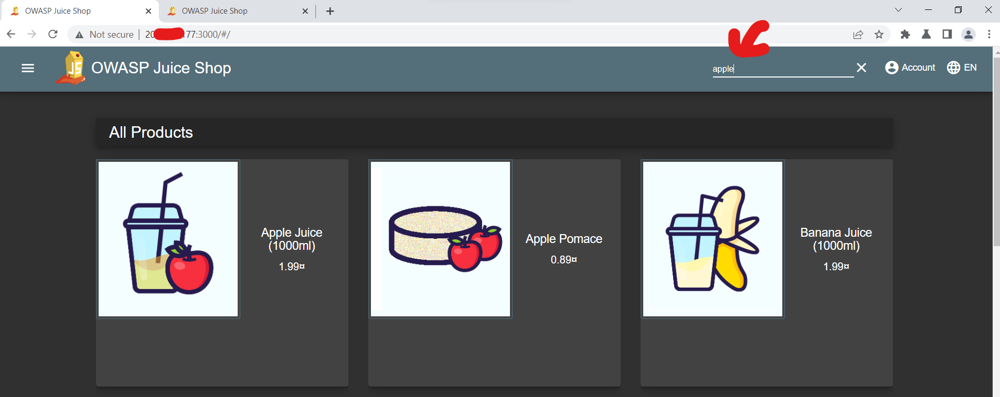  
4. 在Burp Suite界面上点击 ***Proxy*** --> ***HTTP history***查看捕获的针对`/rest/products/search`的请求和响应    
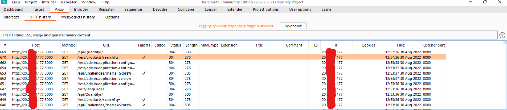  
5. Juice Shop的`/rest/products/search`路径易受SQL注入的影响，我们将会利用该路径上的漏洞进行SQL注入攻击，为了达成攻击目的，需要使用Burp Suite的Repeater功能将构造的SQL查询插入到请求中，需要右键单击针对`/rest/products/search`的GET请求，然后选择`Send to Repeater`  
  
6. 在Burp Suite界面上点击 ***Repeater*** 查看发送到Repeater中的请求  
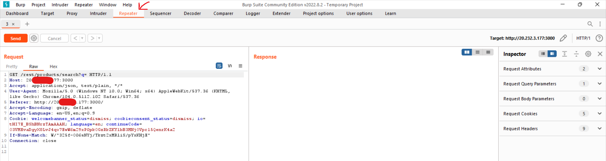  
7. 将需要注入的SQL查询语句进行URL编码 
* 编码前   

```
qwert')) UNION SELECT id, email, password, '4', '5', '6', '7', '8', '9' FROM Users--
```

* 编码后  
```
%71%77%65%72%74%27%29%29%20%55%4e%49%4f%4e%20%53%45%4c%45%43%54%20%69%64%2c%20%65%6d%61%69%6c%2c%20%70%61%73%73%77%6f%72%64%2c%20%27%34%27%2c%20%27%35%27%2c%20%27%36%27%2c%20%27%37%27%2c%20%27%38%27%2c%20%27%39%27%20%46%52%4f%4d%20%55%73%65%72%73%2d%2d
```  
8. 将编码后的SQL查询语句插入到步骤5中发送到Repearter中的请求中 
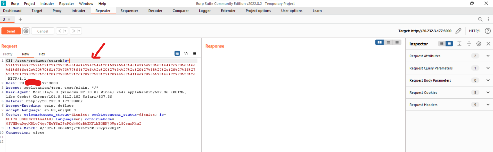  

9. 在点击`send`之后可以发现Juice Shop返回的成功响应，响应中包含了用户和其凭证的详细信息，表明SQL注入是成功的。  
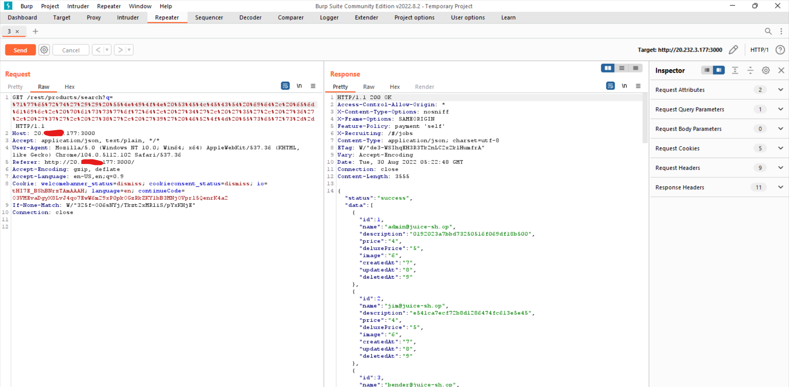  

## 第二次攻击
1. 启动Burp Suite并按照[XSS注入攻击](./Lab-Attack-Local.md)中的`配置Burp Suite`完成Burp Suite的配置
2. 打开Burp Suite内置浏览器直接访问Application Gateway地址 
3. 在Juice Shop网站上搜索栏中搜索`apple`  
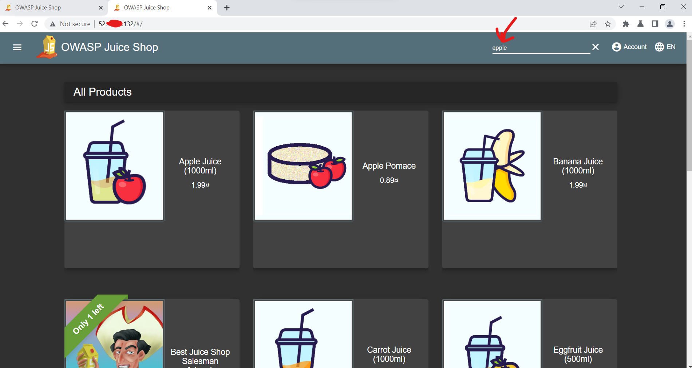
4. 在Burp Suite界面上点击 ***Proxy*** --> ***HTTP history***查看捕获的针对`/rest/products/search`的请求和响应    
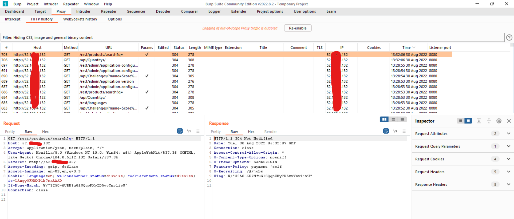
5. Juice Shop的`/rest/products/search`路径易受SQL注入的影响，我们将会利用该路径上的漏洞进行SQL注入攻击，为了达成攻击目的，需要使用Burp Suite的Repeater功能将构造的SQL查询插入到请求中，需要右键单击针对`/rest/products/search`的GET请求，然后选择`Send to Repeater`  
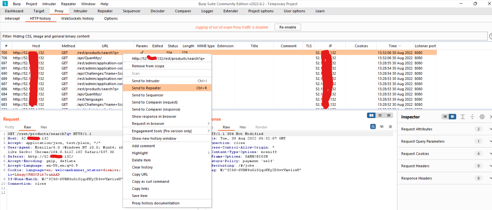  
6. 在Burp Suite界面上点击 ***Repeater*** 查看发送到Repeater中的请求  
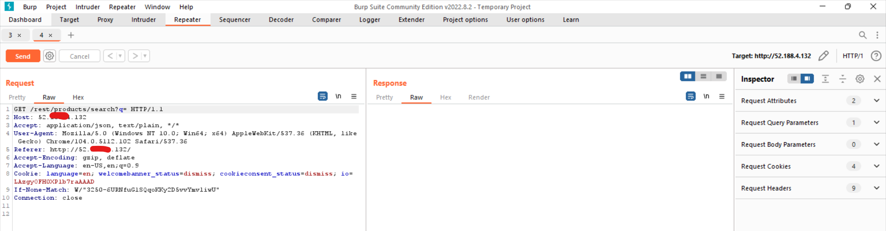  
7. 将需要注入的SQL查询语句进行URL编码 
* 编码前   

```
qwert')) UNION SELECT id, email, password, '4', '5', '6', '7', '8', '9' FROM Users--
```

* 编码后  
```
%71%77%65%72%74%27%29%29%20%55%4e%49%4f%4e%20%53%45%4c%45%43%54%20%69%64%2c%20%65%6d%61%69%6c%2c%20%70%61%73%73%77%6f%72%64%2c%20%27%34%27%2c%20%27%35%27%2c%20%27%36%27%2c%20%27%37%27%2c%20%27%38%27%2c%20%27%39%27%20%46%52%4f%4d%20%55%73%65%72%73%2d%2d
```  
8. 将编码后的SQL查询语句插入到步骤5中发送到Repearter中的请求中 
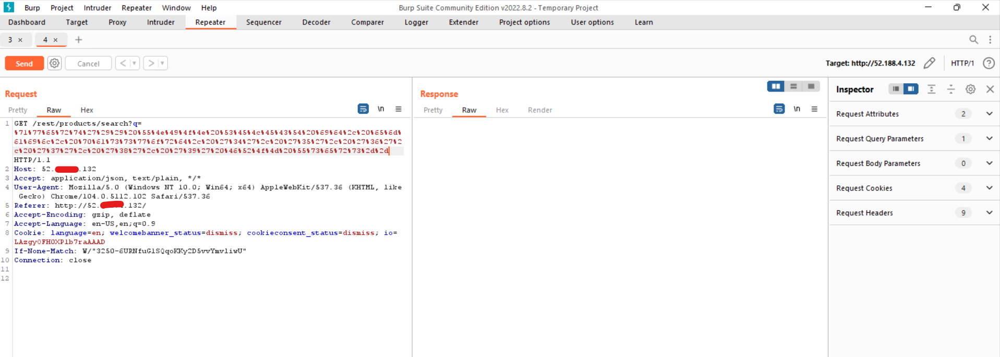  

9. 在点击`send`之后可以发现Juice Shop返回响应，是由`Microsoft-Azure-Application-Gateway/v2`返回的`403 Forbidden`响应，表明SQL注入失败
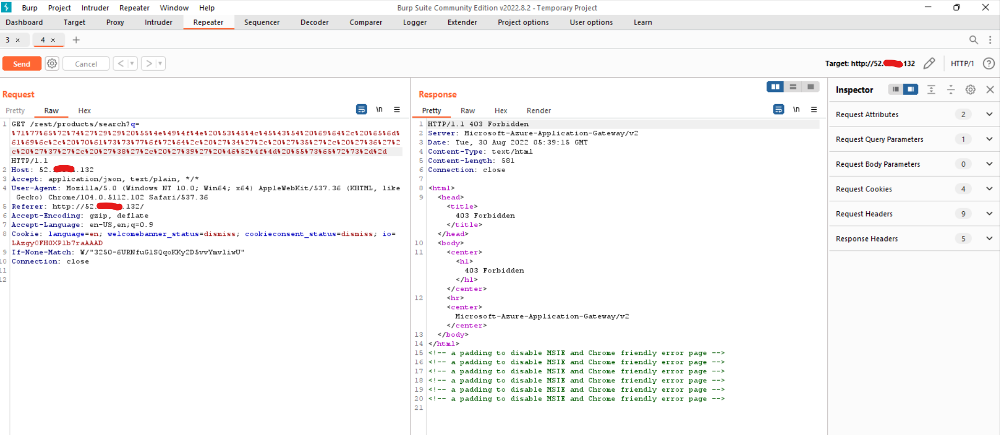

10. 打开Azure WAF Workbook查看相关的数据，可以看到针对/api/feedbacks的XSS注入已经被拦截 
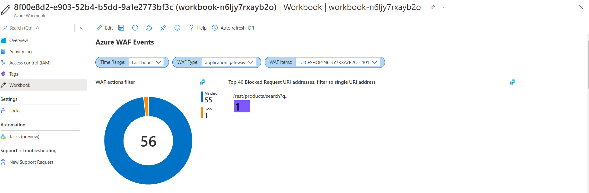 