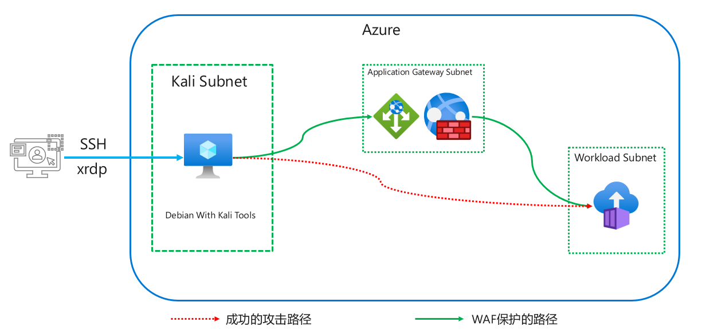

# 简介

如果对Azure非常熟悉，而且对Azure WAF、Application Gateway及Container Instance有一定了解，则可以点击直接部署。
整体实验环境如下图所示,Juice-shop应用将会通过Container Instance服务进行部署，为了尽可能保证环境的安全，该应用不会通过互联网暴露，将通过Kali Subnet中的虚拟机模拟攻击者从Container Instance的内部IP和Internal Application Gateway进行访问。

***注意事项***   
该测试环境仅用作演示用途，请不要在生产环境或者测试环境中进行测试，如需该种类型测试，请在有安全控制措施的私有网络环境下测试并及时删除包含漏洞的应用。在Azure中测试中请设置合理的隔离措施，禁止分配Identity给Container instance。

# 部署Azure测试环境  
本实验提供自动部署和手动部署两个选项，如果对Azure非常熟悉且有过Application Gateway及Container Instance相关使用经验可以使用自动部署部署测试环境，否则建议通过手动部署的方式了解相关服务的配置。
## 自动部署
自动部署通过使用ARM Template实现，可以直接点击如下按钮或者复制[template文件](https://raw.githubusercontent.com/muismu/Azure-WAF-Lab/main/bicep/main.json)通过Azure portal进行部署, 所有参数保持默认即可，无需修改.

## 部署Application Gateway