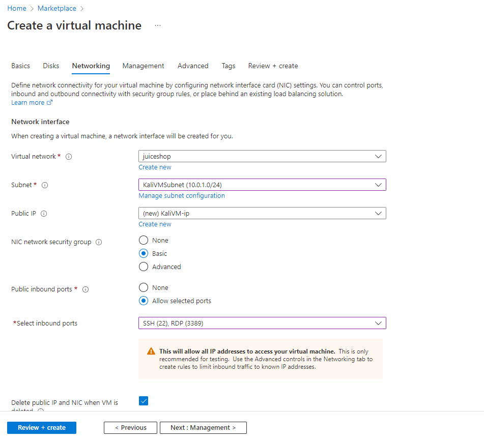

# 简介

整体实验环境如下图所示,Juice-shop应用将会通过Container Instance服务进行部署，为了尽可能保证环境的安全，该应用不会通过互联网暴露，将通过Kali Subnet中的虚拟机模拟攻击者从Container Instance的内部IP和Internal Application Gateway进行访问。


***注意事项***   
该测试环境仅用作演示用途，请不要在生产环境或者测试环境中进行测试，如需该种类型测试，请在有安全控制措施的私有网络环境下测试并及时删除包含漏洞的应用。在Azure中测试中请设置合理的隔离措施，禁止分配Identity给Container instance。

# 部署Azure测试环境  
本实验提供自动部署和手动部署两个选项，如果对Azure非常熟悉且有过Application Gateway及Container Instance相关使用经验可以使用自动部署部署测试环境，否则建议通过手动部署的方式了解相关服务的配置。
## 自动部署
自动部署通过使用ARM Template实现，可以直接点击如下按钮或者复制[template文件](https://raw.githubusercontent.com/muismu/Azure-WAF-Lab/main/bicep/main.json)通过Azure portal进行部署, 除了Region及虚拟机的User Password之外的参数保持默认即可，无需修改。  

[](https://portal.azure.com/#create/Microsoft.Template/uri/https%3A%2F%2Fraw.githubusercontent.com%2Fmuismu%2FAzure-WAF-Lab%2Fmain%2Fbicep%2Fmain.json)
## 手动部署   
### 1. 创建Virtual Network
在本实验中需要创建如下三个子网:    

* Application Gateway Subnet: Application Gateway需要部署在虚拟网络的专有子网中，该子网只能用于部署一个或者多个Application Gateway，不能用于其它用途  
* Kali VM Subnet: 用于部署虚拟机，在虚拟机上模拟攻击对应用进行攻击  
* Workload Subnet: 用于部署Container Instance实例  

进入Azure Portal,点击`+ Create a resource`, 搜索`Virtual network`，点击`Create`进行创建,创建时只需配置Basics和IP Addresses部分的配置，其余保留默认即可,其中三个子网的配置分别如下:   

| Subnet Name              | Subnet Address Space | 
| :-----------------------:| :------------------: |
| ApplicationGatewaySubnet | 10.0.0.0/24 |
| KaliVMSubnet | 10.0.1.0/24 |
| WorkloadSubnet | 10.0.2.0/24 |  

创建VNET，可根据需求更改IP地址空间
  
创建Application Gateway Subnet  
  
创建Kali VM Subnet  
  
创建Workload Subnet  
   

### 2. 创建Kali虚拟机
由于目前在Azure Marketplace上没有官方的Kali Linux镜像，本实验通过使用Debian 11安装相关的kali工具进行 
进入Azure Marketplace搜索`Debian 11 "Bullseye"`,然后点击创建 
  

在配置VM时使用Password的方式，同时Size建议选择2C8G的机型

  

在网络配置时选择步骤1中创建的Workload子网并为虚拟机分配公网IP和开放22、3389两个端口,其它配置保持不变即可。


在虚拟机创建完成后通过SSH登录执行如下命令安装Kali相关工具及Xrdp服务  
```
sudo apt-get update
sudo apt install -y wget gnupg gnupg2 
sudo echo "deb http://http.kali.org/kali kali-rolling main non-free contrib" >> /etc/apt/sources.list.d/kali.list  
wget -q https://archive.kali.org/archive-key.asc
sudo apt-key add archive-key.asc
sudo apt-get update
sudo apt install -y nikto
sudo apt-get install -y dbus-x11
sudo DEBIAN_FRONTEND=noninteractive apt-get -y install xfce4 
sudo apt-get -y install xfce4-session xrdp firefox-esr
echo xfce4-session >~/.xsession
sudo systemctl enable xrdp
sudo systemctl restart xrdp
```  

执行`ss -anp | grep 3389`确认xrdp服务正常运行 


使用Windows远程桌面访问工具访问Kali VM，确认网络及服务配置正确  
  

### 3. 创建Juice Shop实例  
进入Azure Portal,点击`+ Create a resource`, 搜索`Container Instances`，点击`Create`  
    

按照如下的Basics配置及Networking配置创建juice shop实例,本实验我们使用`bkimminich/juice-shop`镜像并选择步骤1中创建的VNET, juice shop应用程序监听`3000`端口。  


 

在资源创建完成后按如下方式检查Juice Shop状态是否正常

  

通过SSH或者Windows远程桌面登录步骤2中创建的虚拟机服务`http://<Container instance Private IP>:3000`确认Jucie Shop服务正常  
 


### 4. 创建WAF Policy
在Azure Portal顶部的搜索栏中输入`Web Application Firewall policies`并选择创建对应资源  
 

Policy的配置如下图所示，仅需修改Basics和Managed Rules两个配置类，在本实验中使用OWASP 3.2规则集,其余保持不变即可:

  

### 5. 创建Application Gateway 
进入Azure Portal,点击`+ Create a resource`, 搜索`Application Gateway`，点击`Create`  
 

在创建Application Gateway时Tier需要选择WAF_V2，Policy选择步骤4中所创建的juice-shop,Virtual Network选择步骤1中所创建的对应资源
  

在配置Frontends的时候需要同时配置Public IP和Static Private IP，WAF_V2版本的Application Gateway不支持只配置Private IP。    
  
  

在配置Backends时选择新建Backends Pool并使用步骤3中所创建的Container Instance的Private IP地址作为Target  
  

在Configuration部分需要增加Routing Rules的配置,在创建Listener选择80端口
 

配置完Listener之后配置Backend Targets 
 

在配置Backend Targets时需要新建Backed Settings 
  
完成上述配置步骤后点击`Create`    

在资源创建完成后使用Kali VM的浏览器或者Curl访问`http://<Application Gateway Private IP>`确认可以正常访问juice shop应用
 


# [下一步](./Lab-Reconnaissance.md)