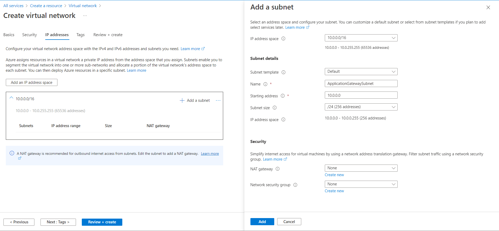
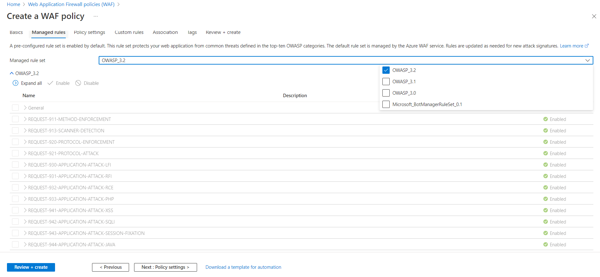
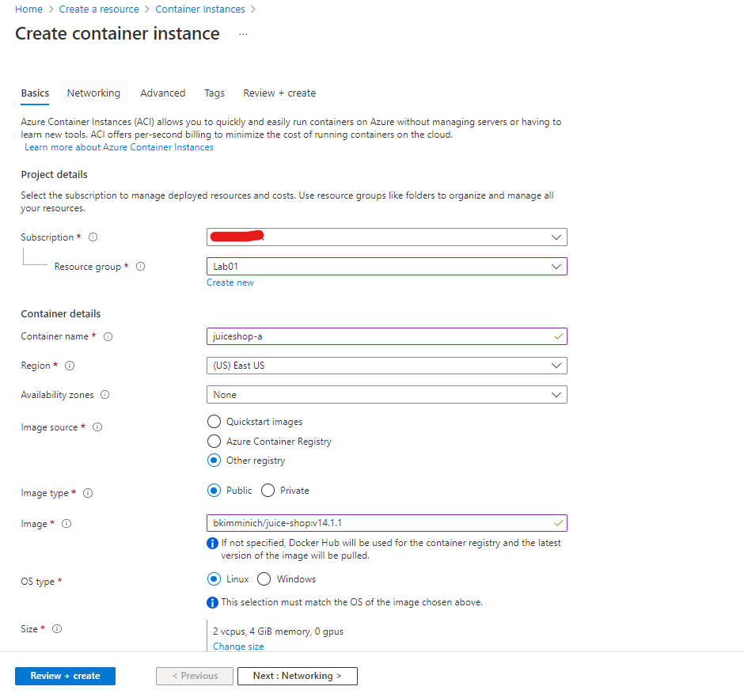
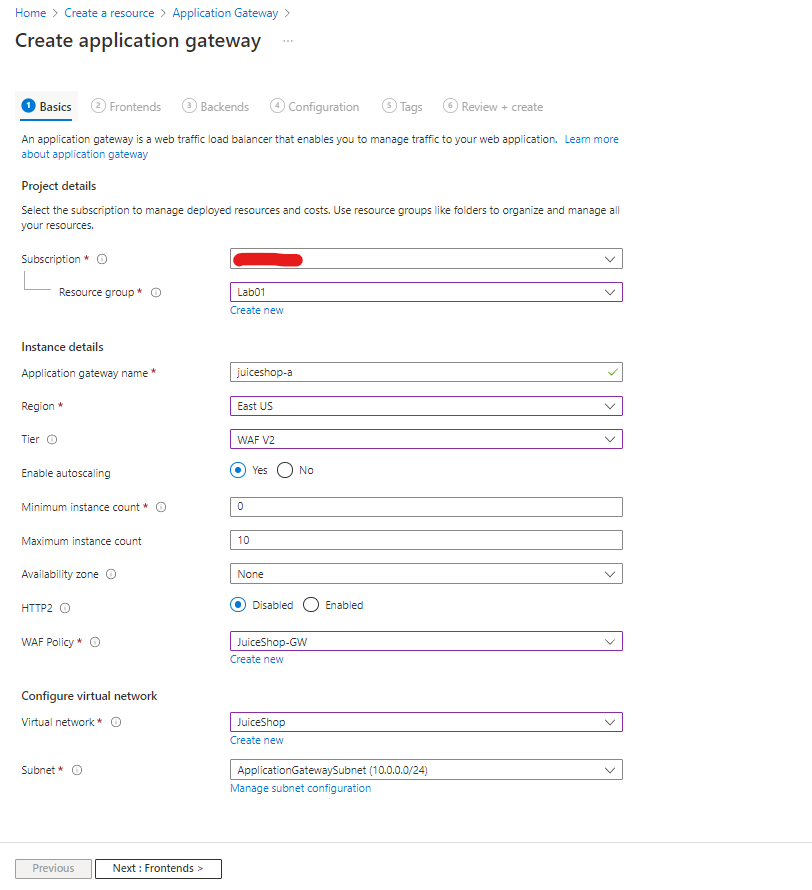
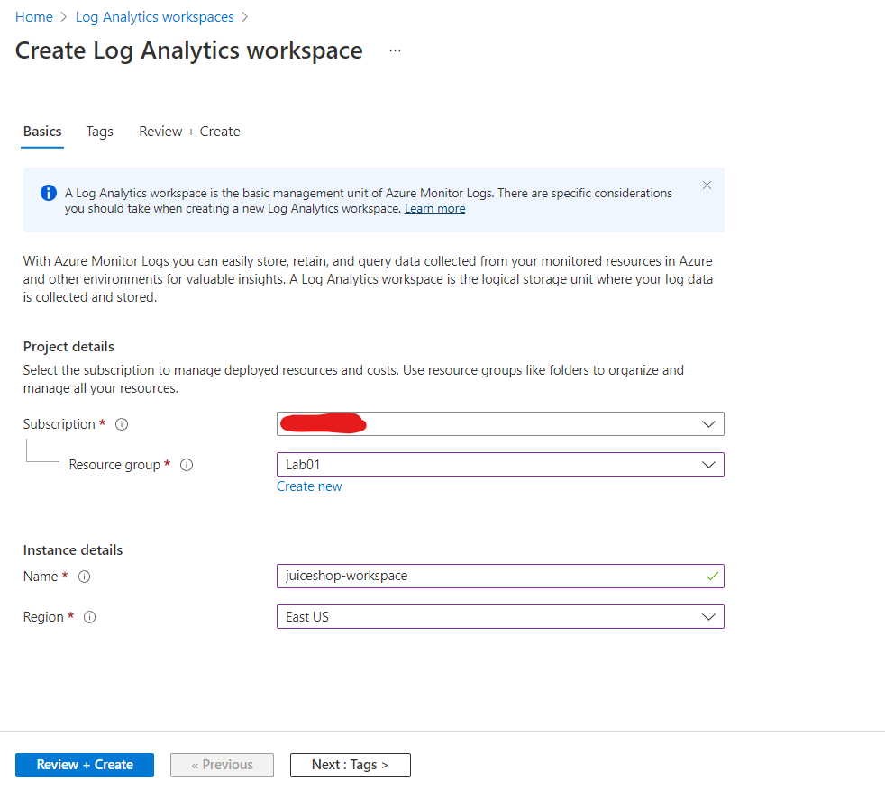
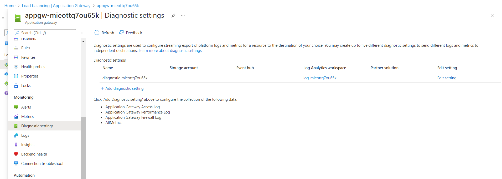

# 简介
整体实验环境如下图所示,Juice-shop应用将会通过Container Instance服务进行部署，为了尽可能保证环境的安全，该应用不会通过互联网暴露，将通过Kali Subnet中的虚拟机模拟攻击者从Container Instance的内部IP和Internal Application Gateway进行访问。

***注意事项***   
该测试环境仅用作演示用途，请不要在生产环境或者测试环境中进行测试，如需该种类型测试，请在有安全控制措施的私有网络环境下测试并及时删除包含漏洞的应用。在Azure中测试中请设置合理的隔离措施，禁止分配Identity给Container instance。

# 部署Azure测试环境  
本实验提供自动部署和手动部署两个选项，如果对Azure非常熟悉且有过Application Gateway及Container Instance相关使用经验可以使用自动部署部署测试环境，否则建议通过手动部署的方式了解相关服务的配置。
## 自动部署
自动部署通过使用ARM Template实现，可以直接点击如下按钮或者复制[template文件](https://raw.githubusercontent.com/muismu/Azure-WAF-Lab/main/bicep/main-vm.json)通过Azure portal进行部署, 除了Region及虚拟机的User Password之外的参数保持默认即可，无需修改。  

## 手动部署   
### 1. 创建Virtual Network
在本实验中需要创建如下三个子网:    

* Application Gateway Subnet: Application Gateway需要部署在虚拟网络的专有子网中，该子网只能用于部署一个或者多个Application Gateway，不能用于其它用途  
* Kali VM Subnet: 用于部署虚拟机，在虚拟机上模拟攻击对应用进行攻击  
* Workload Subnet: 用于部署Container Instance实例  

进入Azure Portal,点击`+ Create a resource`, 搜索`Virtual network`，点击`Create`进行创建,创建时只需配置Basics和IP Addresses部分的配置，其余保留默认即可,其中三个子网的配置分别如下:   

| Subnet Name              | Subnet Address Space | 
| :-----------------------:| :------------------: |
| ApplicationGatewaySubnet | 10.0.0.0/24 |
| KaliVMSubnet | 10.0.1.0/24 |
| WorkloadSubnet | 10.0.2.0/24 |  

创建VNET，可根据需求更改IP地址空间
  
创建Application Gateway Subnet  
  
创建Kali VM Subnet  
  
创建Workload Subnet  
   

### 2. 创建Kali虚拟机
在本实验中，我们将使用一台Windows 11 VM用于配置WSL及安装Burp Suite相关的软件用于后续的测试 
(1). 在Azure Portal中点击`+ Create a resource`, 选择`Virtual machine`，点击`Create`进行创建 

(2). 在Basics部分，按照如下参数进行配置(部分参数未提供,按需求填写即可):  
* Image: `Windows Server 2022 Datacenter`
* Size: `Standard_D2s_v5`  

 

(3). 在Networking部分，按照如下参数进行配置:
* Virtual network: 选择[步骤1](#1-创建virtual-network)中创建的VNet
* Subnet: 选择[步骤1](#1-创建virtual-network)中创建的KaliSubnet
* Public IP: `Create new` 
* NIC networking scurity group: `Basic`
* Public inbound ports: `3389`
* Delete public IP and NIC when VM is deleted: `check`
* Enable accelerated networking: `check`

（4). 其它部分保持默认配置，点击`Review + create`即可

### 3. 创建WAF Policy
(1). 在Azure Portal顶部的搜索栏中输入`Web Application Firewall policies`并选择创建对应资源      

   

(2). 在Web Application Firewall policies界面上点击创建并按照如下图所示配置Baiscs部分  

  

(3). 在配置Managed Rules时选择OWASP 3.2规则集 
  

(4). 其它所有配置保持默认配置，点击`Review + create`即可

### 4. 创建JuiceShop-A实例
(1). 在Azure Portal首页,点击`+ Create a resource`, 搜索`Container Instances`，点击`Create`  

(2). 在Basics配置页面，按照如下配置参数进行配置:  
* Image Source: `Other Registry`
* Image Type: `Public`
* Image: `bkimminich/juice-shop:v14.1.1`
* OS Type: `Linux`
* Size: 2 vCPUs, 4GiB memory, 0 gpus  

(3). 在Networking配置部分，按照如下参数进行配置:  
* Networking Type: `Private`
* Virtual Network: 选择[步骤1](#1-创建virtual-network)中创建的VNet  
* Subnet: 选择[步骤1](#1-创建virtual-network)中创建的Workload子网  
* Ports: 使用tcp/3000端口   

  

(4). 其它配置保持不变，直接点击`Review + create`开始创建资源

### 5. 创建Application Gateway
(1). 在Azure Portal中,点击`+ Create a resource`, 搜索`Application Gateway`，点击`Create`  

(2). 在Baiscs配置部分，按照如下参数进行配置:  
* Tier: `WAF V2`
* WAF Policy: 选择[步骤3](#2-创建waf-policy)中创建的WAF Policy   
* Virtual Network: 选择[步骤1](#1-创建virtual-network)中创建的VNet 
* Subnet: 选择[步骤1](#1-创建virtual-network)中创建的ApplicationGateway子网   

(3). 在Frontends部分，按照如下参数进行配置:  
* Frontend IP address type: `Both`
* Public IP address: `Add new`
* Use a specific private IP address: `yes`
* Private IP address: `10.0.0.10`(ApplicationGatewaySubnet子网中可用的IP即可)

  

(4). 在Backends部分选择`Add a backend pool`, 该backend pool的target为[步骤3](#3-创建juiceshop-a实例)中创建的JuiceShop-A实例Private IP地址  

(5). 在Configuration配置部分,点击`Add a routing rule`添加一条路由规则,规则的配置如下:  
* Rule name: `juiceshop-a`
* Priority: `1000`

Listener部分配置如下:  
* Listener name: `juiceshop-a`
* Front IP: `Private`
* Protocol: `HTTP` 
* Port: `80`
* Listener type: `Basic`
* Error page url: `No`  

在配置Backend targets时Target type选择`Backend pool`，Backend target选择步骤(4)所创建的Backend Pool,Backend settings选择`Add new`进行创建  

在Backend settings部分，主要配置如下:  
* Backend settings name: `juiceshop-a`
* Backend protocol: `HTTP` 
* Backend port: `3000`

其余配置保持不变即可  

(5). 其余配置保持不变，点击`Review + create`进行创建

### 6. 验证Application Gateway正常工作
在资源创建完后登录[步骤2](#2-创建kali虚拟机)创建菜单虚拟机使用浏览器访问`http://<Application Gateway Private IP>`确认可以正常访问juice shop应用

### 7. 创建JuiceShop-B实例
(1). 在Azure Portal首页,点击`+ Create a resource`, 搜索`Container Instances`，点击`Create` 

(2). 在Basics配置页面，按照如下配置参数进行配置:  
* Image Source: `Other Registry`
* Image Type: `Public`
* Image: `bkimminich/juice-shop:v14.1.1`
* OS Type: `Linux`
* Size: 2 vCPUs, 4GiB memory, 0 gpus  

(3). 在Networking配置部分，按照如下参数进行配置:  
* Networking Type: `Private` 
* Virtual network: 选择[步骤1](#1-创建virtual-network)创建的VNet
* Subnet: 选择[步骤1](#1-创建virtual-network)创建的WorkloadSubnet
* Ports: 使用tcp/3000端口   

  

(4). 其它配置保持不变，直接点击`Review + create`开始创建资源

### 8. 验证JuiceShop-B实例正常工作
在资源创建完后登录[步骤2](#2-创建kali虚拟机)创建菜单虚拟机使用浏览器访问`http://<Contianer Instance Private IP>:3000`确认可以正常访问juice shop应用

### 9. 创建Log Analytics Workspace  
(1). 在Azure Portal首页,搜索`Log Analytics workspaces`, 然后点击`Create`

(2). 在Baiscs配置页面，输入workspace的名字及选择对应的区域  

(3). 其它配置保持默认即可，点击`Review + create`创建资源  

### 10. 配置Application Gateway的诊断日志 
(1). 选择[步骤5](#5-创建application-gateway)所创建的Application Gateway  
(2). 打开Application Gateway的`Diagnostic settings`

(3). 点击`Add diagnostic setting`新增配置,按如下配置将Application Gateway Firewall Log发送到[步骤9](#9-创建log-analytics-workspace)中

### 11. 创建WAF Workbook  
点击下面部署按钮部署Azure WAF workbook

在配置的时候需要提供[步骤8]中创建的Workspace的Resource ID, 该ID可以在Workspace的Properties中查询

# [下一步](./Lab-Configure-WSL-Burpsuite.md)