# 简介 
Azure WAF on Front Door为应用程序提供了中心化的防护，其部署再Azure全球网络的边缘，能够检测每一个经由Front Door网络的请求。

Azure Front Door Premium可以通过Private Link连接部署于VNet、Azure App Service或者Azure Storage的源站点，通过Private Link可以避免将服务暴露到互联网上，进一步增强了安全性。

本实验整体环境架构如下图所示:  


# 实验环境部署  
本实验提供自动部署和手动部署两个选项，如果对Azure非常熟悉且有过Load Balancer, Private Link Service及Azure Front Door的相关使用经验可以使用自动部署部署测试环境，否则建议通过手动部署的方式了解相关服务的配置   

## 自动部署   
自动部署通过使用ARM Template实现，可以直接点击如下按钮或者复制[template文件](https://raw.githubusercontent.com/muismu/Azure-WAF-Lab/main/bicep/main-frontdoor.json)通过Azure portal进行部署, 所有参数保持默认即可，无需修改.  

[](https://portal.azure.com/#create/Microsoft.Template/uri/https%3A%2F%2Fraw.githubusercontent.com%2Fmuismu%2FAzure-WAF-Lab%2Fmain%2Fbicep%2Fmain-frontdoor.json)
## 手动部署  

### 1. 创建虚拟网络(VNET)   

***注意事项***   
本部分可以在[基础实验-选项一](./Lab-Environment-VM-WSL.md)或者[基础实验-选项二](./Lab-Environment-Local-WSL.md)的基础上进行，如果使用已有环境，请在后续步骤中调整相应的网络配置  

本实验需要如下三个子网:  
* JuiceshopSubnet: 用于部署Juice Shop应用程序
* LoadBalancerSubnet: 用于部署Azure Load Balancer
* PrivateLinkServiceSubnet: 用于部署Private Link Service   

进入Azure Portal,点击`+ Create a resource`, 搜索`Virtual network`，点击`Create`进行创建,创建时只需配置Basics和IP Addresses部分的配置，其余保留默认即可,其中三个子网的配置分别如下:   

| Subnet Name              | Subnet Address Space | 
| :-----------------------:| :------------------: |
| JuiceshopSubnet | 10.0.0.0/24 |
| LoadBalancerSubnet | 10.0.1.0/24 |
| PrivateLinkServiceSubnet | 10.0.2.0/24 |   

Basics配置部分如下图所示，可以根据需求修改`Virtual network name`和`Region`
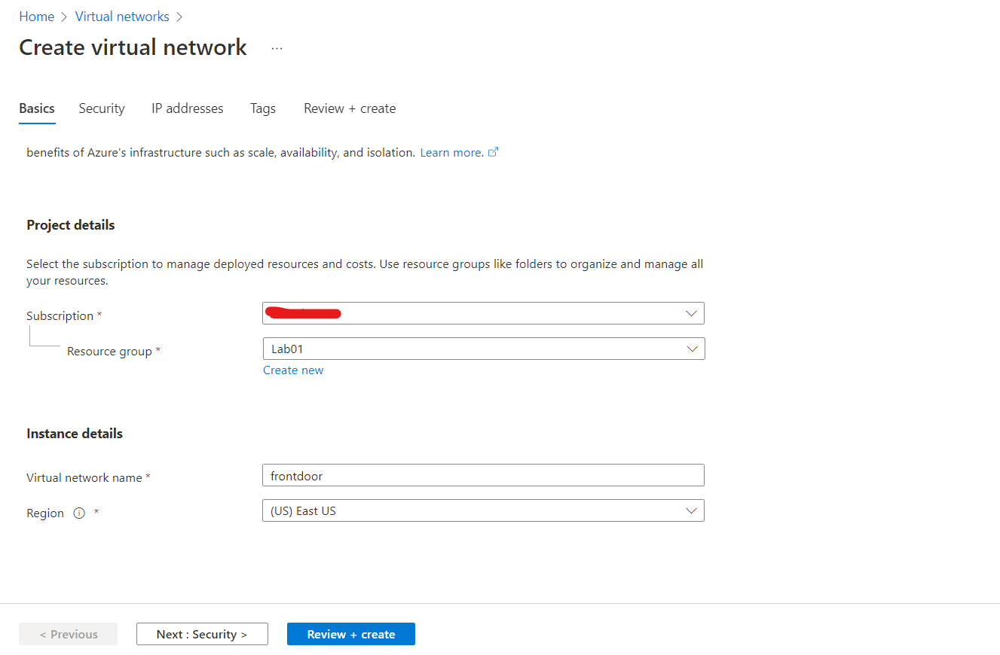  

IP addresses配置部分如后续图片所示进行配置，可以根据需要修改VNET地址空间  
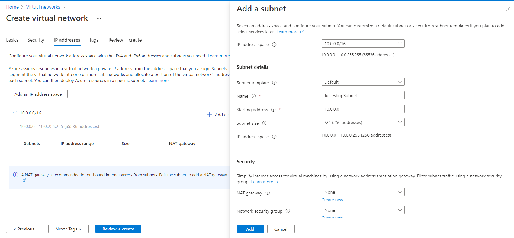  
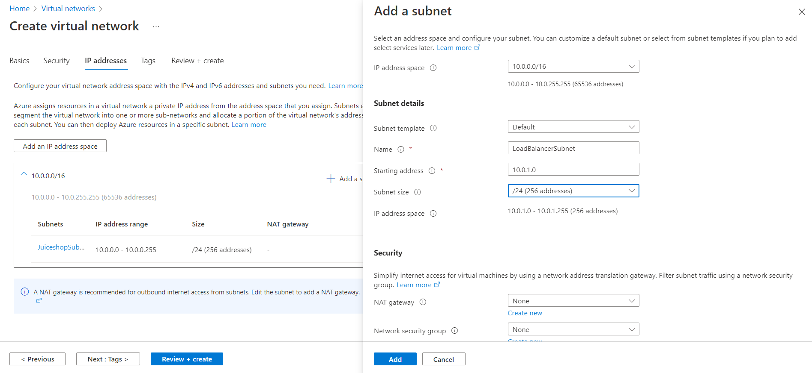
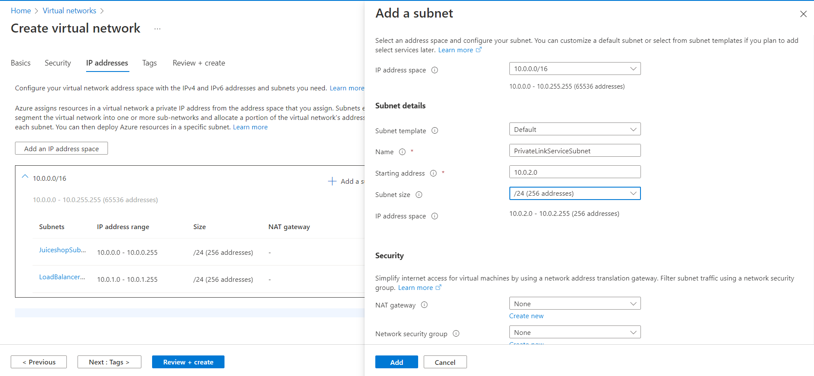
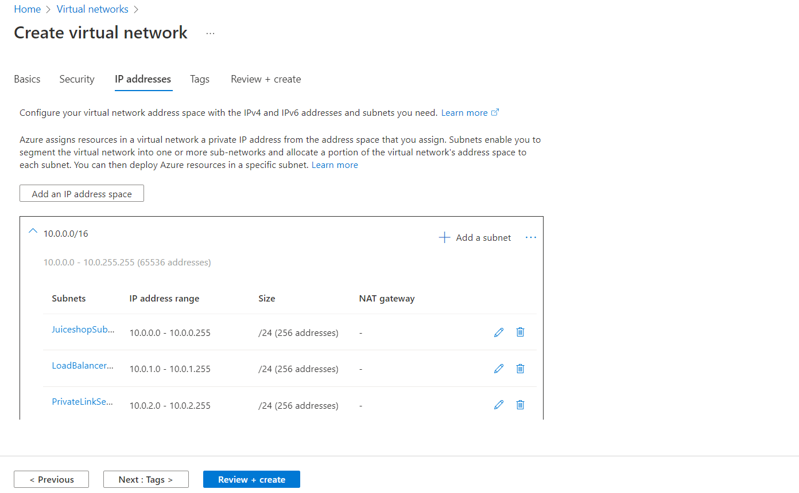  

### 2. 创建NAT gateways    
由于Juice Shop应用程序部署时不选择Public IP，无法直接访问互联网，需要通过NAT gateways进行访问
在Azure Portal中的搜索框中搜素`NAT`,选择`NAT gateways`并点击`Create`  

Basics部分配置如下，可以根据需要修改`NAT gateway name`, `Region`及`Availability zone`等信息 
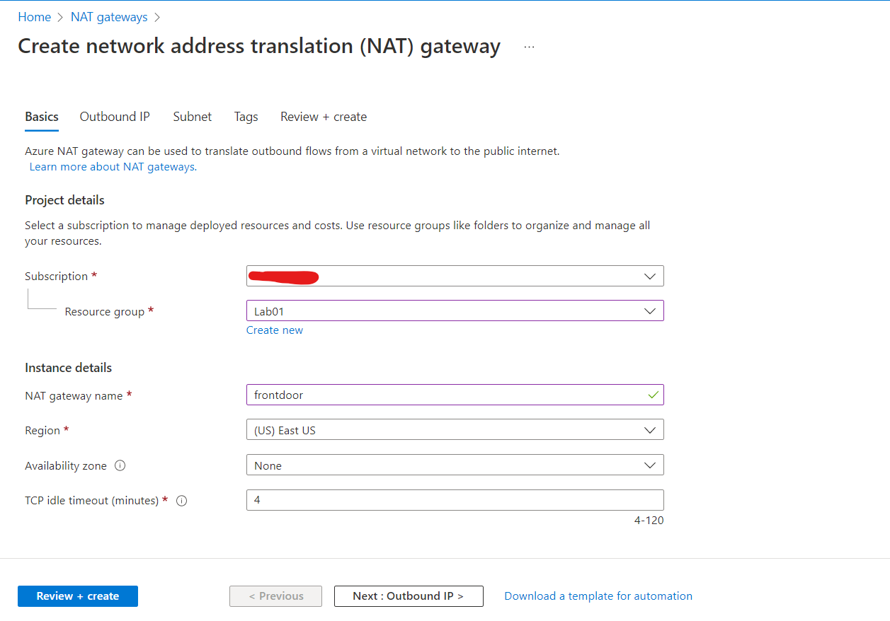

在Outbound IP配置部分，点击`Create a new public IP address`创建一个新的Public IP addresses 
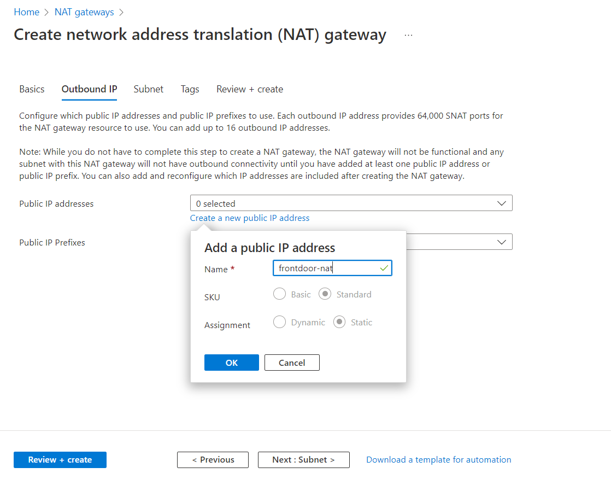

在Subnet配置部分，选择和[步骤一](#创建虚拟网络vnet)中所创建的`JuiceshopSubnet`进行关联，使其能够访问互联网 
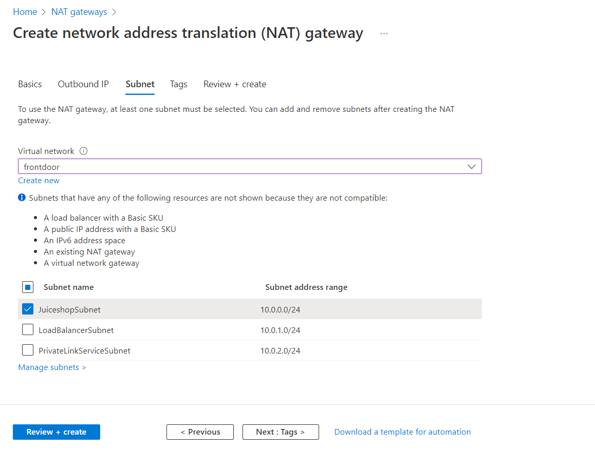

其余配置保持不变，点击`Review + create`提交资源创建请求

### 3. 创建Juice Shop虚拟机  
在本实验中Juice Shop应用程序将通过容器的方式运行在虚拟机中，并暴露80端口

在Azure Portal中的搜索框中搜素`Virtual machines`,选择`Virtual machines`并点击`Create` 

Basics部分的主要配置参数(未提及参数可以按需填写)如下:  
* Virtual machine name: `juiceshop`
* Image: `Ubuntu Server 22.04 LTS - Gen2`
* VM architecture: `x64`
* Size: `Standard_D2s_v5`  
* Authenticaton type: `Password`
* Inbound port rules: `None`

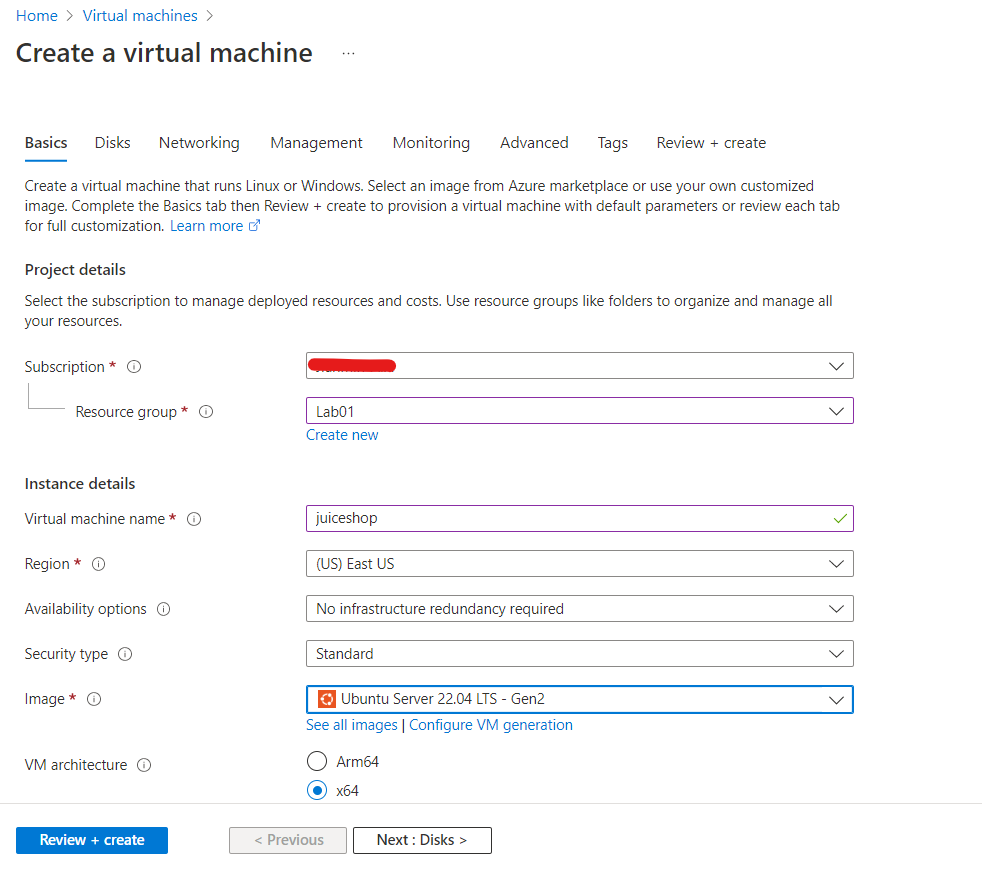

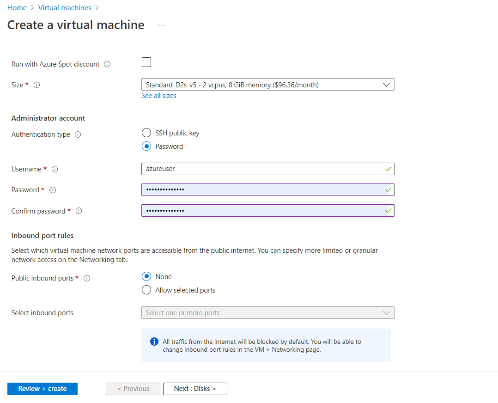  

Networking部分的主要配置参数(未提及参数可以按需填写)如下: 
* Virtual network: [步骤一](#1-创建虚拟网络vnet)中创建的VNET  
* Subnet: [步骤一](#1-创建虚拟网络vnet)中创建的JuiceshopSubnet  
* Public IP: `None`
* NIC network security group: `Basic`
* Public inbound ports:  `Allow selected ports`
* Select inbound ports: `80` 

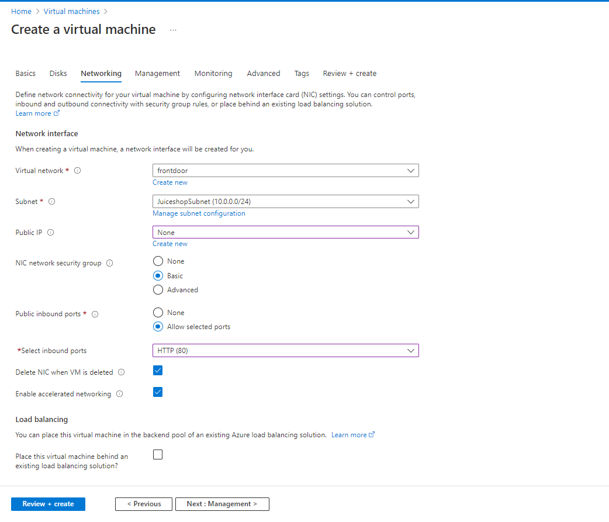

Advanced部分需要配置Custom data，填入如下脚本:   

```
#cloud-config
package_upgrade: true
packages:
  - ca-certificates
  - gnupg
  - gnupg2
  - lsb-release
  - curl
write_files:
  - owner: root:root
    path: /etc/apt/sources.list.d/docker.list
    content: |
      deb http://http.kali.org/kali kali-rolling main non-free contrib
runcmd:
  - sudo mkdir -p /etc/apt/keyrings
  - curl -fsSL https://download.docker.com/linux/ubuntu/gpg | sudo gpg --dearmor -o /etc/apt/keyrings/docker.gpg
  - echo "deb [arch=$(dpkg --print-architecture) signed-by=/etc/apt/keyrings/docker.gpg] https://download.docker.com/linux/ubuntu $(lsb_release -cs) stable" | sudo tee /etc/apt/sources.list.d/docker.list > /dev/null
  - sudo apt-get update
  - sudo apt-get -y install docker-ce docker-ce-cli containerd.io docker-compose-plugin
  - sudo systemctl enable docker
  - sudo systemctl restart docker
  - sudo docker run -p 80:3000 bkimminich/juice-shop:v14.1.1
```  

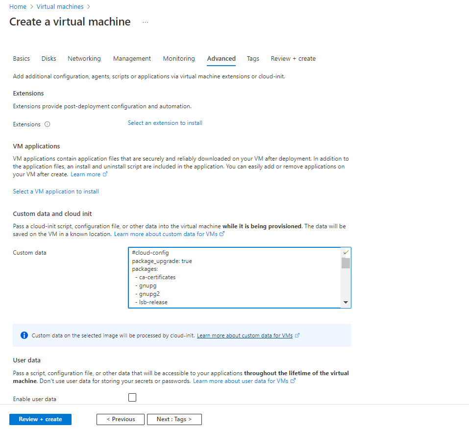

其它部分保持默认配置,点击`Create + review`提交资源创建请求

### 4. 创建Load Balancer 
Internal Load Balancer是创建Private Link Service的必要条件，并且在创建Backend Pool时必须使用NIC的模式  

在Azure Portal中的搜索框中搜素`Load Balancer`,选择`Load Balancer`并点击`Create` 

Basics部分的主要配置参数(未提及参数可以按需填写)如下:  
* Name: `juiceshop`
* SKU: `Standard`
* Type: `Internal`
* Tier: `Regional` 

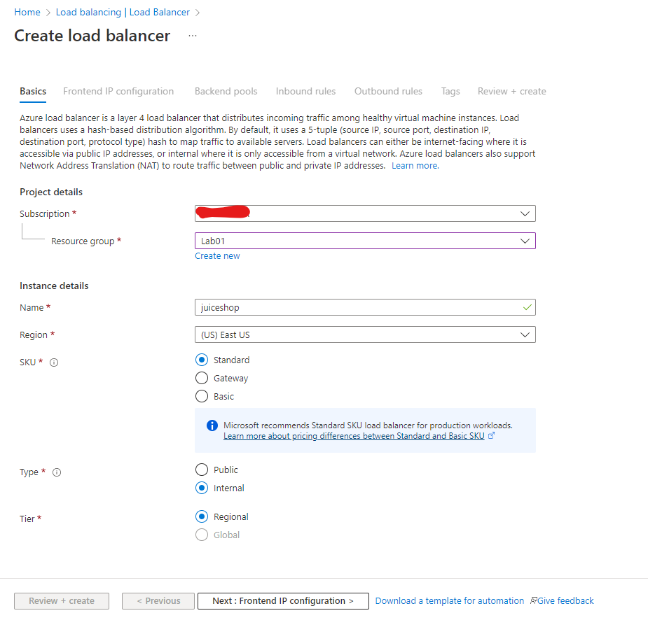  

在Frontend IP部分，点击`Add a frontend IP configuration`, 具体配置如下:  
* Name: `juiceshop`
* Virtual network: [步骤一](#1-创建虚拟网络vnet)中创建的VNET  
* Subnet: [步骤一](#1-创建虚拟网络vnet)中创建的LoadBalancerSubnet
* Assignment: `Dynamic`  

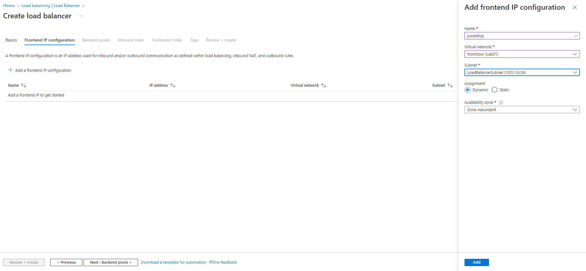

在Backend Pools部分，点击`Add a backend pool`，具体配置如下:  
* Name: `juiceshop`

在IP configuratons部分点击`Add`,选择[步骤三]中创建的虚拟机

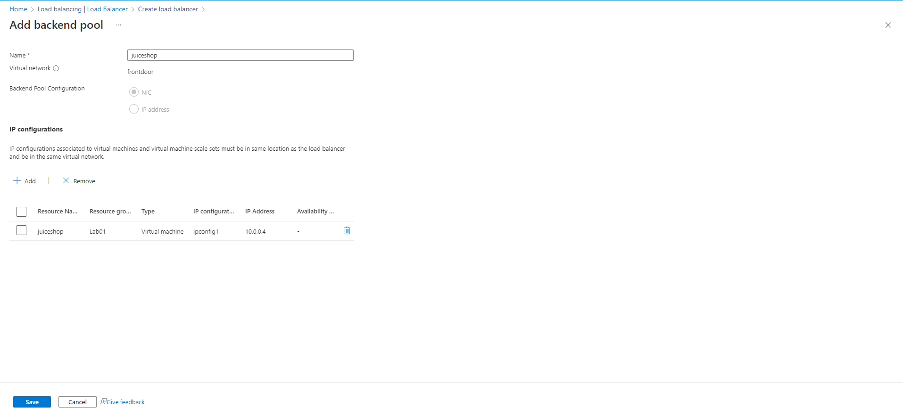

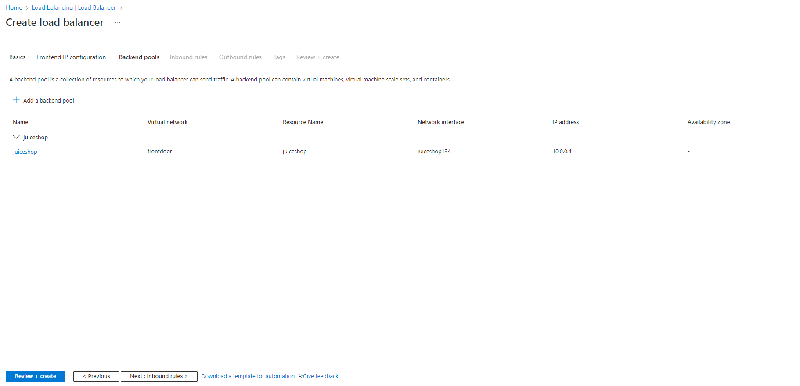

在Inbound rules部分，点击`Add a load balancing rule`，创建新的规则,规则配置如下: 
* Name: `juiceshop` 
* IP Version: `IPv4`
* Frontend IP address: 选择前面所创建的Frontend IP
* Backend pool: 选择Backend Pools中所创建的backend
* Protocol: `TCP`
* Port: `80`
* Backend port: `80`
* Health probe: `Create new`

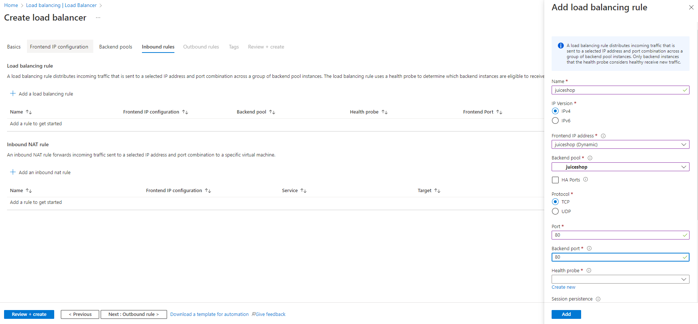  

Health probe的配置如下: 
* Name: `juiceshop`
* Protocol: `HTTP`
* Port: `80`
* Path: `/`
* interval: `5`

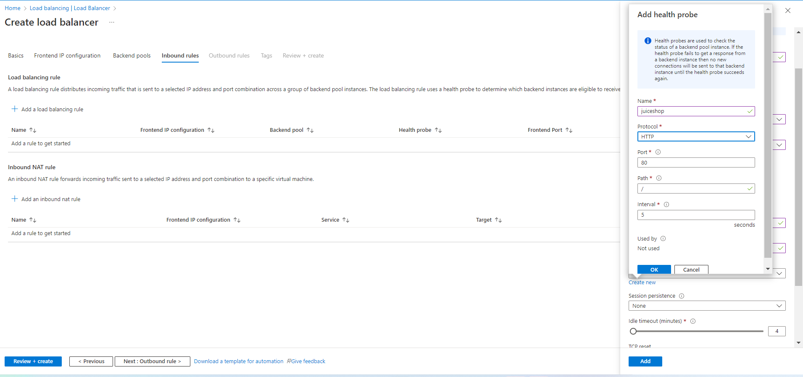

其它配置保持默认即可，点击`Create + review`提交资源创建  

### 5. 创建Private link services 
在Azure Portal中的搜索框中搜素`Private link services`,选择`Private link services`并点击`Create`  

Basics配置部分按实际需求选择即可:  
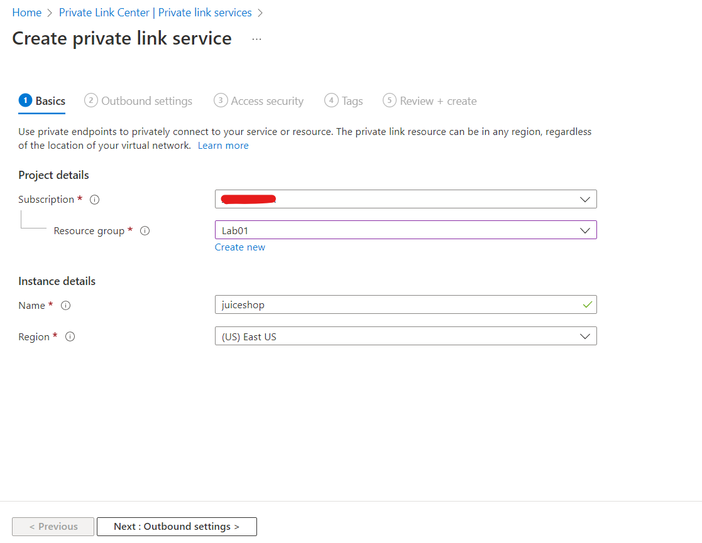

Outbound settings部分配置如下:  
* Load balancer: 选择[步骤四]中创建的Load Balancer  
* Load balancer frontend IP address: 选择[步骤四]中创建的Load Balancer的frontend IP  
* Source NAT Virtual network: 选择[步骤一](#1-创建虚拟网络vnet)中创建的VNET
* Source NAT subnet:  选择[步骤一](#1-创建虚拟网络vnet)中创建的PrivateLinkServiceSubnet
* Enable TCP proxy V2: `No`
* Private IP address settings-Allocation: `Dynamic`  

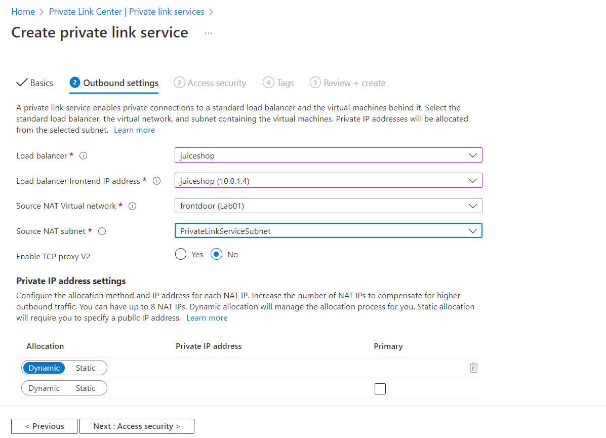

其余部分配置保持默认即可，点击`Create + review`提交资源创建