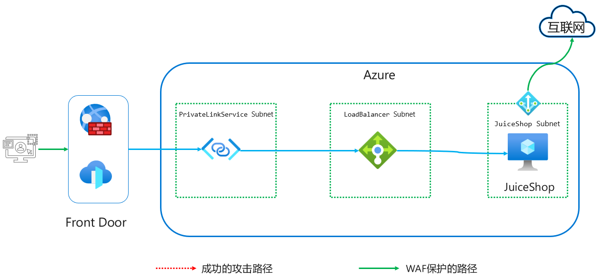

# 简介 
Azure WAF on Front Door为应用程序提供了中心化的防护，其部署再Azure全球网络的边缘，能够检测每一个经由Front Door网络的请求。

Azure Front Door Premium可以通过Private Link连接部署于VNet、Azure App Service或者Azure Storage的源站点，通过Private Link可以避免将服务暴露到互联网上，进一步增强了安全性。

本实验整体环境架构如下图所示:  

# 实验环境部署  
本实验提供自动部署和手动部署两个选项，如果对Azure非常熟悉且有过Load Balancer, Private Link Service及Azure Front Door的相关使用经验可以使用自动部署部署测试环境，否则建议通过手动部署的方式了解相关服务的配置   

## 自动部署   
自动部署通过使用ARM Template实现，可以直接点击如下按钮或者复制[template文件](https://raw.githubusercontent.com/muismu/Azure-WAF-Lab/main/bicep/main-frontdoor.json)通过Azure portal进行部署, 所有参数保持默认即可，无需修改.  

## 手动部署