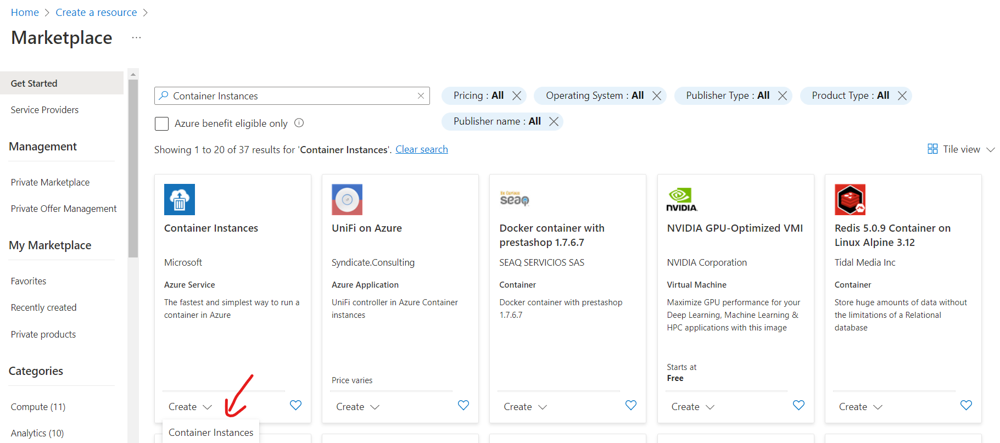
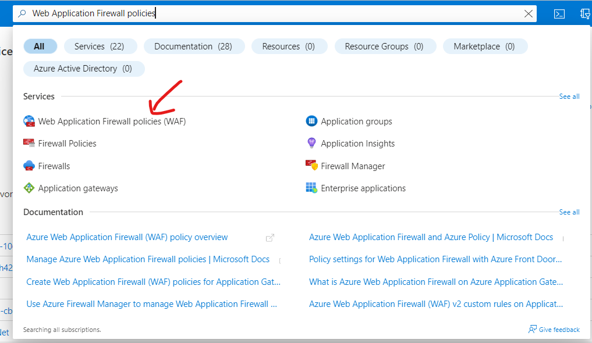
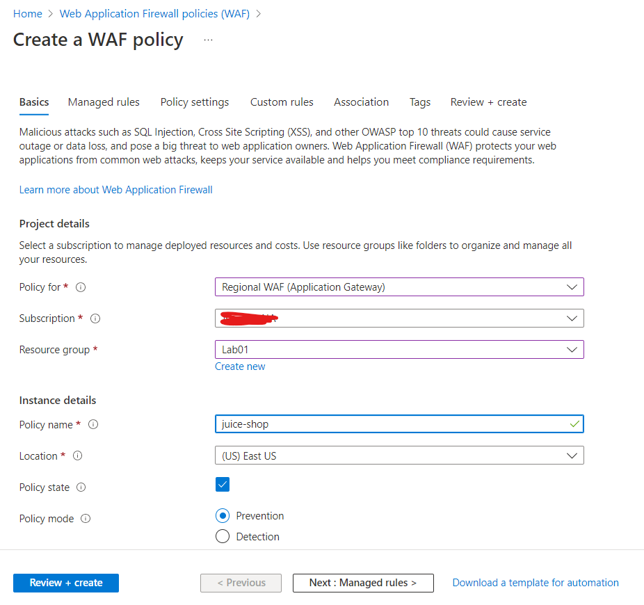
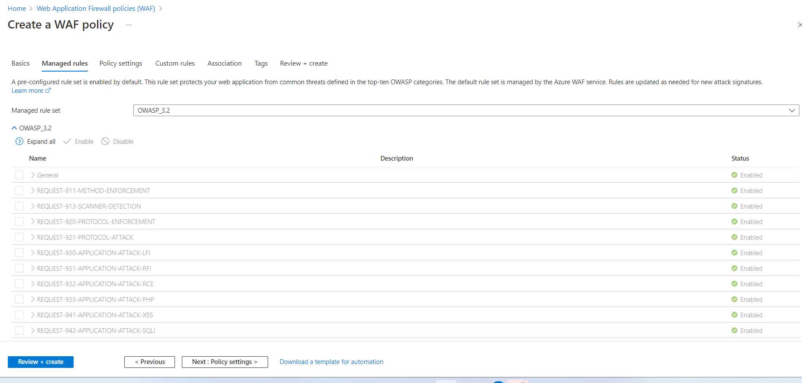
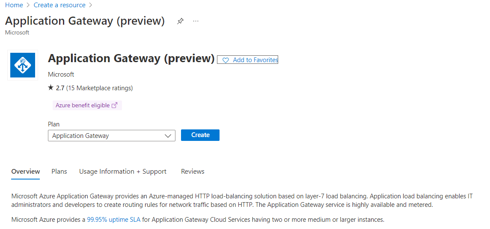

# 简介  
Windows Subsystem for Linux (WSL)可以使开发者在Windows上无需运行虚拟机或者采用双启动模式的情况下直接运行GNU/Linux环境，配合VS Code远程开发的功能提供更好的开发体验。本实验通过直接讲OWASP Juice Shop应用程序及Application Gateway直接暴露到公网上来支持使用WSL Kali Linux进行测试，测试架构如下:  
  

***注意事项***   
该测试环境仅用作演示用途，请不要在生产环境或者测试环境中进行测试，如需该种类型测试，请在有安全控制措施的私有网络环境下测试并及时删除包含漏洞的应用。在Azure中测试中请设置合理的隔离措施，禁止分配Identity给Container instance。

## 部署Azure测试环境  
本实验提供自动部署和手动部署两个选项，如果对Azure非常熟悉且有过Application Gateway及Container Instance相关使用经验可以使用自动部署部署测试环境，否则建议通过手动部署的方式了解相关服务的配置。
### 自动部署
自动部署通过使用ARM Template实现，可以直接点击如下按钮或者复制[template文件](https://raw.githubusercontent.com/muismu/Azure-WAF-Lab/main/bicep/main-wsl.json)通过Azure portal进行部署, 所有参数保持默认即可，无需修改.
[](https://portal.azure.com/#create/Microsoft.Template/uri/https%3A%2F%2Fraw.githubusercontent.com%2Fmuismu%2FAzure-WAF-Lab%2Fmain%2Fbicep%2Fmain-wsl.json)
### 手动部署   
#### 1. 创建Juice Shop实例  
进入Azure Portal,点击`+ Create a resource`, 搜索`Container Instances`，点击`Create`  
    

按照如下的Basics配置及Networking配置创建juice shop实例,本实验我们使用`bkimminich/juice-shop`镜像并选择Public Network, juice shop应用程序监听`3000`端口。 


在完成Basics和Networking配置后可以直接选择`Review + create`，其它配置项可按实际情况配置,创建完成后查看对应资源，确认juice shop如下图所示运行正常.  


#### 2. 确认Juice Shop的运行状态  
打开浏览器访问`http://<Container Instance的Public IP地址>:3000`,正常页面如下图所示:  
 

#### 3. 创建WAF Policy
在Azure Portal顶部的搜索栏中输入`Web Application Firewall policies`并选择创建对应资源  
 

Policy的配置如下图所示，仅需修改Basics和Managed Rules两个配置类，在本实验中使用OWASP 3.2规则集,其余保持不变即可:



#### 4. 创建Virtual Network  
Application Gateway需要部署在虚拟网络的专有子网中，该子网只能用于部署一个或者多个Application Gateway，不能用于其它用途。    

进入Azure Portal,点击`+ Create a resource`, 搜索`Virtual network`，点击`Create`进行创建,创建时只需配置Basics和IP Addresses部分的配置，其余保留默认即可  
  

#### 5. 创建Application Gateway   
进入Azure Portal,点击`+ Create a resource`, 搜索`Application Gateway`，点击`Create`  
   
在创建Application Gateway时Tier需要选择WAF_V2，Policy选择步骤3中所创建的juice-shop,Virtual Network选择步骤4中所创建的对应资源
 

在配置Frontends时选择创建新的Public IP  
 

在配置Backends时选择新建Backends Pool并使用步骤1中所创建的Container Instance的Public IP地址作为Target  
 

在Configuration部分需要增加Routing Rules的配置,在创建Listener选择80端口
 

配置完Listener之后配置Backend Targets 
 

在配置Backend Targets时需要新建Backed Settings 
  
完成上述配置步骤后点击`Create`  

#### 6. 验证Application Gateway正常工作
在资源创建完成后使用浏览器访问`http://<Application Gateway Public IP>`确认可以正常访问juice shop应用


## Windows WSL Kali Linux配置
### 安装WSL   
打开Windows开始菜单，搜索"Turn Windows features on or off"并打开，打开的窗口中选择勾选Hyper-V并确定
  
在安装完成后需要重启机器  

### 安装Kali Linux
打开Microsoft Store(微软应用商店)搜索Kali Linux并安装，安装完成后打开设置用户名及密码:


### 安装Kali Linux Tools 
打开Windows Terminal并选择Kali Linux，执行如下命令:   
```
sudo apt update
sudo apt install -y kali-win-kex
sudo apt install -y kali-linux-large
```
### 设置Kali Linux桌面 
执行`kex`命令，设置相关密码后即可使用Kali Linx桌面

# [下一步](./Lab-Reconnaissance.md)