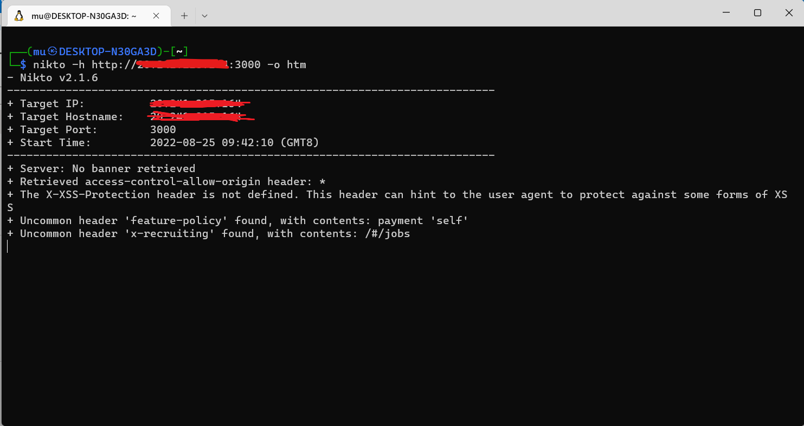
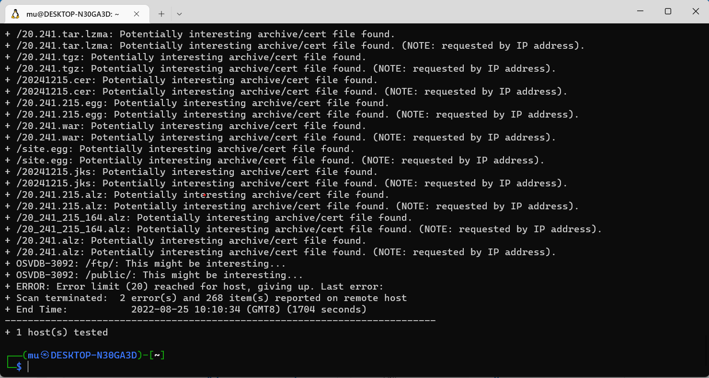
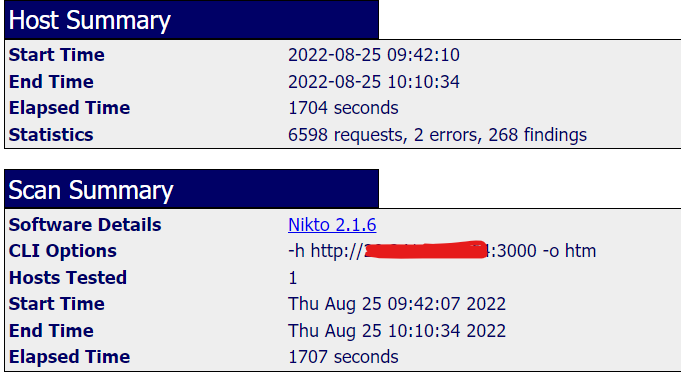
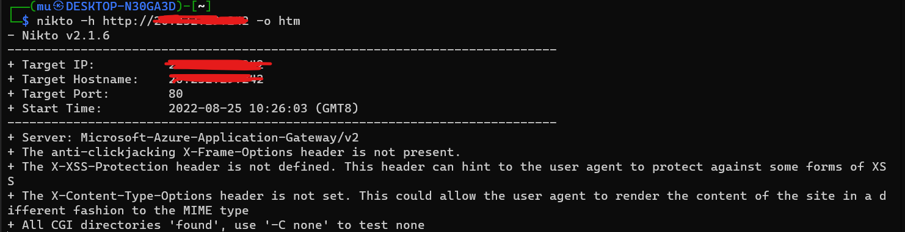
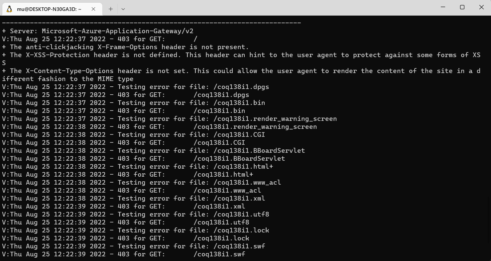
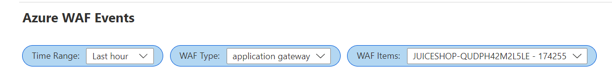
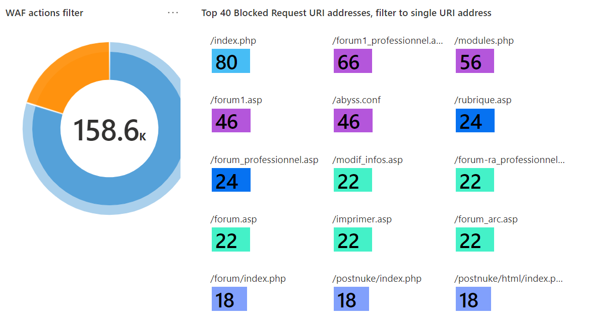
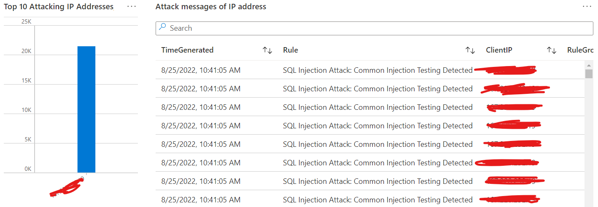

# 简介  
本动手实验的目的是展示Azure WAF在识别和保护针对Web应用程序的可疑活动及潜在攻击的能力，本阶段将测试Azure WAF的OWSAP规则对于来自于被广泛使用的常用攻击工具的侦察攻击的检测和防护。

本阶段的测试保护如下四个主要部分:   

* 通过漏扫程序针对运行OWASP Juice Shop应用程序的Container Instance直接进行扫描   
* 通过漏扫程序扫描通过Application Gateway(启用WAF)发布的Juice Shop应用程序 
* 对比两次扫描结果的差异 
* 查看Azure Monitor Workbook for WAF的展示结果     
   

# 前提条件  
在开始本阶段测试前，需要通过[设置Azure WAF攻击测试环境](./Lab-Environment-Setup.md)或者[设置WSL及Azure WAF攻击测试环境](./Lab-WSL.md)完成实验环境的准备。  


# 测试步骤   
## 侦察攻击(Reconnaissance Attack)  
攻击者会尝试的第一件事情是试图去获取对目标应用程序包含的组件，所使用的框架以及潜在的漏洞，攻击者通常会花费大量时间研究目标应用程序，收集应用程序相关数据试图找到其中的漏洞。收集敏感安全数据识别应用程序潜在漏洞的方式之一是利用Web应用程序漏洞扫描工具，漏洞扫描工具可以分析应用程序的响应数据(e.g. HTTP Headers)识别潜在的漏洞。通过Web应用程序漏洞扫描工具收集的数据能够识别出潜在的漏洞以供攻击者测试、开发恶意程序最终用来攻击或者窃取数据。这些侦察活动也能够使攻击者获取对应用程序的深入了解并保留相关信息供后续攻击使用。    

## 执行侦察攻击  
执行侦察攻击最快速、最常见的方法是使用商业或者开源的Web应用程序漏洞扫描工具(Security Scanners)针对目标运行未经过认证和授权的扫描，在本实验中，我们利用[nikto](https://github.com/sullo/nikto)工具分别对两个不同的访问路径进行扫描。  
* 第一次扫描直接针对Juice Shop应用程序  
** URL: Contianer Instance的IP地址，未使用WSL则为Private IP
* 第二次扫描针对通过Application Gateway(WAF)发布的Juice Shop  
** Application Gateway的IP地址，未使用WSL则为Private IP

### 第一次扫描    
1. 通过RDP登录Azure VM并打开Terminal或者通过Windows Terminal打开Kali Linux  
2. 执行如下命令  
```
nikto -h http://<container instance ip>:3000 -o htm
# 取决于实验环境配置，<container instance ip>可以为Private或者Public IP
```
#### 扫描开始

#### 扫描结束

3. 下载并用浏览器打开htm文件，显示扫描结果如下:

### 第二次扫描
1. 通过RDP登录Azure VM并打开Terminal或者通过Windows Terminal打开Kali Linux  
2. 执行如下命令  
```
nikto -h http://<Application Gateway Front ip> -o htm
# 取决于实验环境配置，<Application Gateway Front ip>可以为Private或者Public IP
```  
***注意事项***   
在针对启用了WAF功能的Application Gateway进行扫描时请求可能会被全部拦截，导致长时间无结果，在此种情况下请执行如下命令查看具体情况:   
```
nikto -h http://<Application Gateway Front ip> -Display v
```  
如果所有请求响应码均为403，则说明请求已经被WAF拦截，可以继续后续实验步骤。 

#### 扫描开始

#### 扫描结束
   

## 分析WAF日志
1. 打开Azure Workbook服务并选择环境设置过程中创建的WAF Workbook, 进入workbook后，在过滤器中选择合适的 **Time Range**, **WAF Type** 和 **WAF Items**  
  

2. 探索Workbook所提供的可视化信息


  

3. 通过Log Analytics分析WAF日志   
在本实验中，Application Gateway WAF的相关日志会被发送至前面步骤所创建的Log Analytics Workspace中的AzureDiagnostics表中。可以通过ResourceType和OperationName进行过滤，可以参考如下查询语句进行日志查询分析。  

Log Analytics使用[KQL](https://docs.microsoft.com/en-us/azure/data-explorer/kql-quick-reference)进行查询，具体语法可以参考其文档。

```
AzureDiagnostics
| where ResourceType == "APPLICATIONGATEWAYS"
| where OperationName == "ApplicationGatewayFirewall" or Category == "WebApplicationFirewallLogs"
| extend Rule= iif(Message contains "Mandatory rule. Cannot be disabled.", strcat_array(split(Message, "Mandatory rule. Cannot be disabled. Inbound ", 1), ""), Message)
| extend Rule = iif(Rule contains "Total Inbound Score", strcat_array(array_concat(split(Rule, " - SQLI=", 0), parse_json('[") -"]'), split(Rule, "):", 1)), ""), Rule)
| summarize count() by Rule
| top 50 by count_ desc
```