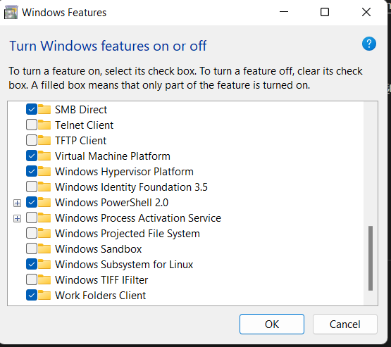

# 简介  
Windows Subsystem for Linux (WSL)可以使开发者在Windows上无需运行虚拟机或者采用双启动模式的情况下直接运行GNU/Linux环境，配合VS Code远程开发的功能提供更好的开发体验。本实验通过直接讲OWASP Juice Shop应用程序及Application Gateway直接暴露到公网上来支持使用WSL Kali Linux进行测试，测试架构如下:  
  

***注意事项***   
该测试环境仅用作演示用途，请不要在生产环境或者测试环境中进行测试，如需该种类型测试，请在有安全控制措施的私有网络环境下测试并及时删除包含漏洞的应用。在Azure中测试中请设置合理的隔离措施，禁止分配Identity给Container instance。

## 部署Azure测试环境  
### 自动部署 
### 手动部署

## Windows WSL Kali Linux配置
### 安装WSL   
打开Windows开始菜单，搜索"Turn Windows features on or off"并打开，打开的窗口中选择勾选Hyper-V并确定
 
在安装完成后需要重启机器  

### 安装Kali Linux
打开Microsoft Store(微软应用商店)搜索Kali Linux并安装，安装完成后打开设置用户名及密码:


### 安装Kali Linux Tools 
打开Windows Terminal并选择Kali Linux，执行如下命令:   
```
sudo apt update
sudo apt install -y kali-win-kex
sudo apt install -y kali-linux-large
```